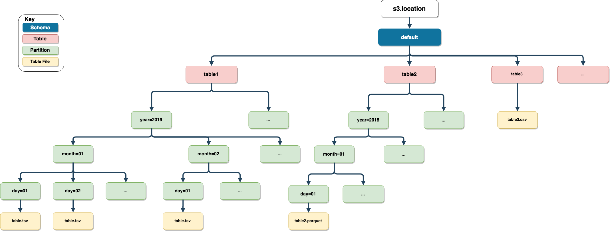

`AWS Athena` allows SQL querying to be performed on [AWS S3 buckets](https://aws.amazon.com/s3/). To gain access to this, the correct permission level will need to be enabled.

# AWS S3 Structures

When uploading data into `AWS Athena`. Firstly `noctua` uploads the data into `AWS S3`, then registers the table in `AWS Athena`. When appending data to an existing `AWS Athena` table, `noctua` adds the data in the specified `AWS S3` partition and then repairs the `AWS Athena` table. 

`noctua` uses the parameter: `s3.location` from the function `dbWriteTable` for the `AWS S3` location. If `s3.location` isn't specified then the location is taken from the initial connection (`dbConnect`). 

`noctua` aligns the `s3.location` to the following `AWS S3` structure: `{s3.location}/{schema}/{table_name}/{partition}/{file}` (remember that `s3.location` has to be in [s3 uri format](https://docs.aws.amazon.com/AmazonS3/latest/dev/UsingBucket.html): "s3://bucket-name/key-name"). This is to allow tables with same name being uploaded to different schemas. 

```{r, echo = F}

```

**NOTE:** `noctua` won't duplicate the table name or schema if they have been provided in `s3.location`. For example:

```r
dbWriteTable(con, "myschema.table", table, 
             s3.location = "s3://mybucket/myschema/table",
             partition = c("year" = "2020"))

# AWS S3 location
"s3://mybucket/myschema/table/year=2020/table.tsv"
```

# File Types

Currently `noctua` supports the following file types `[".tsv", ".csv", ".parquet"]`. For `parquet` files, the package [arrow](https://arrow.apache.org/docs/r/) is used. This package will have to be installed, before data can be sent to `AWS S3` in `parquet` format.

`noctua` also supports compression when uploading data to `AWS S3`. For delimited files (`".tsv"` and `".csv"`), [gunzip compression](https://en.wikipedia.org/wiki/Gzip) is used. When using gunzip compression, `noctua` will split the zipped file into a maximum of 20 equal parts. This is to speed up how `AWS Athena` queries gunzip compressed files ([Default Compression Method for Flat Files](https://github.com/DyfanJones/RAthena/issues/36)). [Snappy](https://en.wikipedia.org/wiki/Snappy_(compression)) compression is used for compressing `parquet` files.

# Useful links

* [AWS Athena performance tips](https://aws.amazon.com/blogs/big-data/top-10-performance-tuning-tips-for-amazon-athena/)
